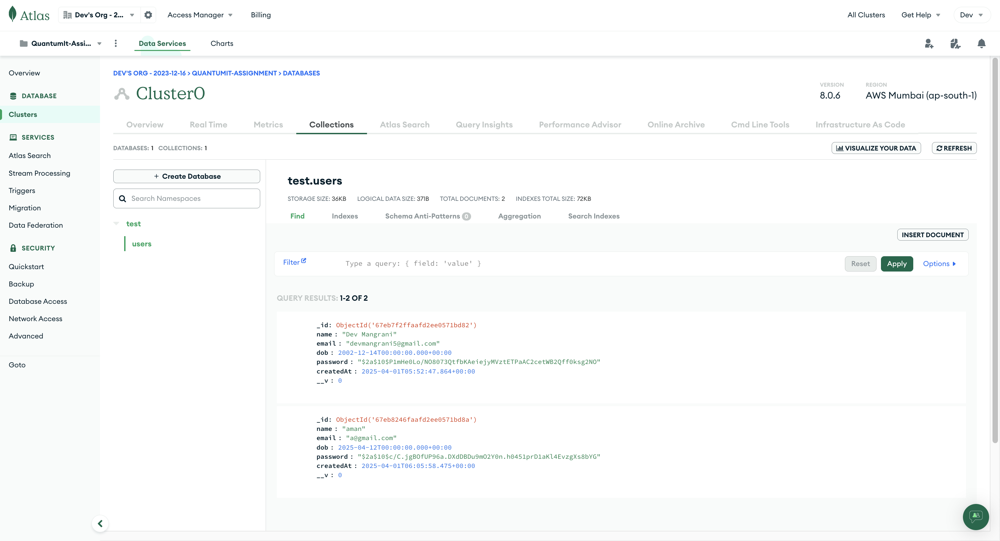

# Quantum IT Innovation - Full Stack Development Assignment

This project is a full-stack web application built for Quantum IT Innovation's Full Stack Development Intern position. It implements a secure user authentication system with login and registration functionality, followed by a protected dashboard interface.

## Features

- 🔐 User Authentication
  - Login functionality
  - Registration with required fields
  - JWT-based authentication
  - Protected routes
- 📊 Dashboard
  - User management table
  - Search functionality
  - Filtering capabilities
  - Responsive design
- 🔒 Security
  - Password hashing
  - JWT token implementation
  - Protected API endpoints
  - Local storage management

## Tech Stack

### Frontend
- React.js
- React Router for navigation
- CSS3 for styling
- Local Storage for state management

### Backend
- Node.js
- Express.js
- MongoDB
- JWT for authentication
- bcrypt for password hashing

## Prerequisites

Before running this project, make sure you have the following installed:
- Node.js (v14 or higher)
- MongoDB
- npm or yarn

## Installation

1. Clone the repository
```bash
git clone https://github.com/Devmangrani/QuantumIT-Assignment.git
cd QuantumIT-Assignment
```

2. Install dependencies for both frontend and backend
```bash
# Install frontend dependencies
npm install
npm run dev

# Install backend dependencies
cd server
npm install
npm run server
```

3. Set up environment variables
Create a `.env` file in the backend directory with the following variables:
```
MONGODB_URI=your_mongodb_connection_string
JWT_SECRET=your_jwt_secret
PORT=5000
```


## Screenshots

### Login Page

*Login interface with email and password fields*

### Registration Page

*Registration form with required fields*

### Dashboard


*User management dashboard with search and filter options*

## API Endpoints

### Authentication
- `POST /api/auth/register` - Register a new user
- `POST /api/auth/login` - Login user

### User Data Structure
```javascript
{
  name: String,
  dateOfBirth: Date,
  email: String,
  password: String (hashed)
}
```

## MongoDB Schema

### User Collection
```javascript
{
  _id: ObjectId,
  name: String,
  dateOfBirth: Date,
  email: String,
  password: String,
  createdAt: Date,
  updatedAt: Date
}
```

### Sample MongoDB Document
```javascript
{
  "_id": ObjectId("..."),
  "name": "John Doe",
  "dateOfBirth": ISODate("1990-01-01"),
  "email": "john@example.com",
  "password": "$2b$10$...", // Hashed password
  "createdAt": ISODate("2024-03-31T10:00:00Z"),
  "updatedAt": ISODate("2024-03-31T10:00:00Z")
}
```

## Features Implementation

### Registration Form
- Name input field
- Date of birth picker
- Email input field
- Password input field
- Form validation
- Error handling

### Login Form
- Email input field
- Password input field
- Remember me option
- Error handling

### Dashboard
- Protected route implementation
- User information display
- Search functionality
- Filtering options
- Responsive table design
- Pagination

## Security Features
- Password hashing using bcrypt
- JWT token generation and validation
- Protected API routes
- Secure local storage management
- Input validation and sanitization

## Project Structure
```
QuantumIT-Assignment/
├── frontend/
│   ├── src/
│   │   ├── components/
│   │   ├── styles/
│   │   ├── utils/
│   │   └── App.js
│   └── package.json
├── backend/
│   ├── src/
│   │   ├── controllers/
│   │   ├── models/
│   │   ├── routes/
│   │   └── server.js
│   └── package.json
├── screenshots/
│   ├── login.png
│   ├── register.png
│   └── dashboard.png
└── README.md
```

## Author
Dev Mangrani

## Made for
Quantum IT Innovation


## License
This project is created as part of the Full Stack Development Intern position assignment at Quantum IT Innovation.
